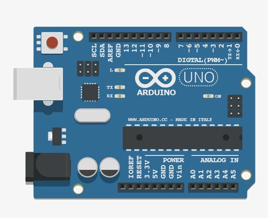
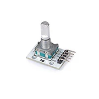
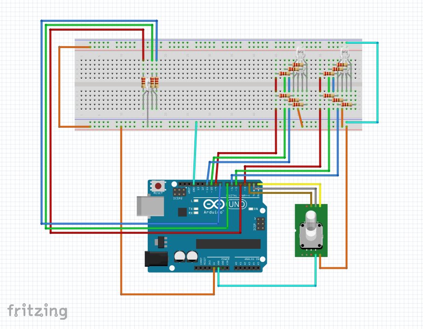

# Led-RGB :

*Ce projet est realiser dans le but d'apprendre la programmation arduino.* 

## Le projet :

Ce projet consiste à réaliser une lampe led RGB connectée, pilotable via une interface web. 

### Caractéristique :

#### Controle :

La lampe sera programmée via un **Arduino UNO** qui gerera les differents parametres, les séquences pré-programmée...

#### Design de la lampe :

La lampe sera realiser en bois de type multiplex 3mm decoupé au laser.

**Le socle** sera un pyramide de cercles creux qui contiendra les éléments electroniques (Arduino UNO, module WIFI / Bluetooth, carte led, alimentation). Sur le socle, il y aura également un encodeur digital rotatif (pour l'alumage et le paramatrage) et une led RGB de faible intensité afin d'avoir un retour visuel sur le parametrage. 

exemple :

- led rouge = reglage de l'intensité lumineuse.
- led bleue = sequences pré-programmées.
- led verte = couleur fixe

**La lampe** sera une sphere creuse constituée de plaque ajourées permettrant la diffusion de la lumiere. 

#### Matériel :

- Arduino UNO.
- 1 encodeur digital rotatif ***Whadda :*** **WPI435**.
- 5 Leds RGB a anode commune. (2*2 pour l'interieur + 1 pour le parametrage).
- 15 resistances 220ohms.
- 1 BreaBoard *pour les tests*

**Arduino UNO :**

**Led RGB *anode commune* :**

**Encodeur Digital Rotatif :**

## Planche de test :

## Fonctionnement :

La lampe est consituer de 2x2 leds RGB qui fond l'eclairage principal. Elle sont nommées : **led1** et **led2**.
Il y a une troisième led RGB qui permet à l'utilisateur de voir dans quel mode il se trouve. **led0**
Un encodeur rotatif permet le controler de lampe.

**Encodeur digital rotatif :**

L'encodeur rotatif **Whadda : WPI435** possède un fonction rotative à 20 crans par revolution, ainsi qu'un fonction switch lorsque l'on presse le bouton.

#### Comportement de l'encodeur :

Par defaut lors de l'allumage de l'arduino, toutes les leds sont etteintent.

- Au premier clic sur le bouton (clic-1):
    - *led0 = vert*
    - *led1 et led2 = ambre*
    - *rotation de l'encodeur = null*
- clic-2
    - *led0 = orange*
    - *led1 et led2 = blanc chaud*
    - *rotation de l'encodeur = null*
- clic-3
    - *led0 = magenta*
    - *led1 et led2 = blanc RGB*
    - *rotation de l'encodeur = null*
- clic-4
    - *led0 = bleue*
    - *led1 et led2 = change de couleur lorsque l'on tourne le bouton de l'encodeur*
    - *rotation de l'encodeur = actif*
- clic-5
    - *led0 = rouge*
    - *led1 et led2 = change de couleur automatiquement toutes les 2secondes*
    - *rotation de l'encodeur = null*
- clic-6
    - *led0 = blanc*
    - *led1 et led2 = simule un feux de cheminée*
    - *rotation de l'encodeur = null*
- clic-7
    - *Eteint toutes les leds*
    - *Remet le compteur de clic à 0*

## Fonctions à ajouter :

- reglage de l'intensité lumineuse lors d'un double clic sur le bouton. 
- divers mode de couleur.
- Changement de couleur au rythme de la musique avec un capteur audio.
- Pilotage via une interface web en local. **Ajout module wifi/bleutooth** au **Arduino UNO**.
- Realisation d'un app android pour le controle de la lampe.
- Connecter la lampe à **google Home** afin de la controler. 

## Code :

**Particulatiré : Je dois inverser la valeur RGB pour mes leds. 0=100% et 255=0%**

    #include <Encoder.h>

    Encoder encoder(1, 2);
    int switchPin = 0;

    long encoderValue = 0;
    bool buttonState = HIGH;
    bool lastButtonState = HIGH;
    unsigned long lastDebounceTime = 0;
    unsigned long debounceDelay = 50;
    int buttonPressCount = 0;
    bool colorChangeMode = false;
    unsigned long lastColorChangeTime = 0;
    unsigned long colorChangeInterval = 2000;
    bool simulateFireActive = true;
    bool rotationEnabled = false;

    int led0r = 4;
    int led0g = 7;
    int led0b = 8;
    int led1r = 3;
    int led1g = 5;
    int led1b = 6;
    int led2r = 9;
    int led2g = 10;
    int led2b = 11;

    const int numColors = 16;
    const int colors[numColors][3] = {
    {0, 255, 255},    // Rouge
    {255, 0, 255},    // Vert
    {255, 255, 0},    // Bleu
    {0, 0, 255},  // Jaune
    {0, 255, 0},  // Magenta
    {255, 0, 0},  // Cyan
    {0, 128, 255},  // Orange
    {128, 0, 255},  // Lime
    {128, 255, 0},  // Violet
    {0, 128, 128}, // Rose
    // Ajoutez les couleurs supplémentaires ici
    };

    int currentColorIndex = 0;
    int maxEncoderValue = 20;

    void buttonInterrupt() {
    buttonPressCount++;
    }

    void simulateFire();

    void setup() {
    pinMode(led0r, OUTPUT);
    pinMode(led0g, OUTPUT);
    pinMode(led0b, OUTPUT);
    pinMode(led1r, OUTPUT);
    pinMode(led1g, OUTPUT);
    pinMode(led1b, OUTPUT);
    pinMode(led2r, OUTPUT);
    pinMode(led2g, OUTPUT);
    pinMode(led2b, OUTPUT);

    pinMode(switchPin, INPUT_PULLUP);

    analogWrite(led0r, 255);
    analogWrite(led0g, 255);
    analogWrite(led0b, 255);
    analogWrite(led1r, 255);
    analogWrite(led1g, 255);
    analogWrite(led1b, 255);
    analogWrite(led2r, 255);
    analogWrite(led2g, 255);
    analogWrite(led2b, 255);

    attachInterrupt(digitalPinToInterrupt(switchPin), buttonInterrupt, FALLING);
    simulateFireActive = false;
    Serial.begin(9600);
    }

    void loop() {
    int reading = digitalRead(switchPin);
    if (rotationEnabled) {
        long newEncoderValue = encoder.read();
        if (newEncoderValue != encoderValue) {
        encoderValue = newEncoderValue;
        }
    }

    if (reading != lastButtonState) {
        lastDebounceTime = millis();
    }

    if ((millis() - lastDebounceTime) > debounceDelay) {
        if (reading != buttonState) {
        buttonState = reading;

        if (buttonState == LOW) {
            buttonPressCount++;

            if (buttonPressCount == 1) {
            // Premier appui
            analogWrite(led0r, 255);
            analogWrite(led0g, 0);
            analogWrite(led0b, 255);
            analogWrite(led1r, 0);
            analogWrite(led1g, 128);
            analogWrite(led1b, 255);
            analogWrite(led2r, 0);
            analogWrite(led2g, 128);
            analogWrite(led2b, 255);
            rotationEnabled = false;
            } else if (buttonPressCount == 2) {
            // Deuxième appui
            analogWrite(led0r, 0);
            analogWrite(led0g, 0);
            analogWrite(led0b, 255);
            analogWrite(led1r, 0);
            analogWrite(led1g, 0);
            analogWrite(led1b, 0);
            analogWrite(led2r, 0);
            analogWrite(led2g, 0);
            analogWrite(led2b, 0);
            rotationEnabled = false;
            } else if (buttonPressCount == 3) {
            // Troisième appui
            analogWrite(led0r, 0);
            analogWrite(led0g, 255);
            analogWrite(led0b, 0);
            analogWrite(led1r, 0);
            analogWrite(led1g, 50);
            analogWrite(led1b, 100);
            analogWrite(led2r, 0);
            analogWrite(led2g, 50);
            analogWrite(led2b, 100);
            rotationEnabled = false;
            } else if (buttonPressCount == 4) {
            // Quatrième appui : Activer le mode de sélection de couleur manuelle
            analogWrite(led0r, 255);
            analogWrite(led0g, 255);
            analogWrite(led0b, 0);
            analogWrite(led1r, 0);
            analogWrite(led1g, 255);
            analogWrite(led1b, 0);
            analogWrite(led2r, 0);
            analogWrite(led2g, 255);
            analogWrite(led2b, 0);
            encoderValue = 0;
            rotationEnabled = true;
            colorChangeMode = false;
            } else if (buttonPressCount == 5) {
            // Cinquième appui : Activer le mode de changement automatique de couleur
            analogWrite(led0r, 0);
            analogWrite(led0g, 255);
            analogWrite(led0b, 255);
            colorChangeMode = true;
            lastColorChangeTime = millis();
            rotationEnabled = false;
            } else if (buttonPressCount == 6) {
            // Sixième appui : Activer la simulation de feu
            analogWrite(led0r, 0);
            analogWrite(led0g, 0);
            analogWrite(led0b, 0);
            simulateFireActive = true;
            simulateFire();
            rotationEnabled = false;
            } else if (buttonPressCount == 7) {
            // Septième appui : Éteindre toutes les LEDs
            analogWrite(led0r, 255);
            analogWrite(led0g, 255);
            analogWrite(led0b, 255);
            analogWrite(led1r, 255);
            analogWrite(led1g, 255);
            analogWrite(led1b, 255);
            analogWrite(led2r, 255);
            analogWrite(led2g, 255);
            analogWrite(led2b, 255);
            colorChangeMode = false;
            buttonPressCount = 0;
            rotationEnabled = false;
            }

            Serial.print("Clic count: ");
            Serial.println(buttonPressCount);
        }
        }
    }

    lastButtonState = reading;

    if (colorChangeMode) {
        unsigned long currentTime = millis();

        if (currentTime - lastColorChangeTime >= colorChangeInterval) {
        currentColorIndex = (currentColorIndex + 1) % numColors;
        analogWrite(led1r, colors[currentColorIndex][0]);
        analogWrite(led1g, colors[currentColorIndex][1]);
        analogWrite(led1b, colors[currentColorIndex][2]);
        analogWrite(led2r, colors[currentColorIndex][0]);
        analogWrite(led2g, colors[currentColorIndex][1]);
        analogWrite(led2b, colors[currentColorIndex][2]);
        lastColorChangeTime = currentTime;
        }
    } else if (rotationEnabled) {
        long newEncoderValue = encoder.read();
        if (newEncoderValue != encoderValue) {
        encoderValue = newEncoderValue;
        currentColorIndex = map(encoderValue, 0, maxEncoderValue, 0, numColors);
        analogWrite(led1r, colors[currentColorIndex][0]);
        analogWrite(led1g, colors[currentColorIndex][1]);
        analogWrite(led1b, colors[currentColorIndex][2]);
        analogWrite(led2r, colors[currentColorIndex][0]);
        analogWrite(led2g, colors[currentColorIndex][1]);
        analogWrite(led2b, colors[currentColorIndex][2]);
        Serial.print("Selected Color: R=");
        Serial.print(colors[currentColorIndex][0]);
        Serial.print(", G=");
        Serial.print(colors[currentColorIndex][1]);
        Serial.print(", B=");
        Serial.println(colors[currentColorIndex][2]);
        }
    }
    }
    void simulateFire() {
    const int numFireColors = 3;
    const int fireColors[numFireColors][3] = {
        {0, 220, 255},  // Rouge
        {0, 150, 255},  // Orange
        {0, 100, 255}   // Jaune
    };

    int fireIntensity = 0;

    while (buttonPressCount == 6) {
        // Simuler un effet de feu de cheminée
        int randomColor = random(0, numFireColors);  // Choisissez une couleur aléatoire de feu
        fireIntensity = random(100, 255);  // Variation d'intensité aléatoire

        analogWrite(led1r, fireColors[randomColor][0] * fireIntensity / 255);
        analogWrite(led1g, fireColors[randomColor][1] * fireIntensity / 255);
        analogWrite(led1b, fireColors[randomColor][2] * fireIntensity / 255);

        analogWrite(led2r, fireColors[randomColor][0] * fireIntensity / 255);
        analogWrite(led2g, fireColors[randomColor][1] * fireIntensity / 255);
        analogWrite(led2b, fireColors[randomColor][2] * fireIntensity / 255);

        // Ajoutez un léger retard pour créer des variations crépitantes
        delay(random(50, 200));

        if (buttonPressCount != 6) {
        // Sortez de la boucle si le bouton a été pressé à nouveau
        break;
        }
    }

    // Éteindre les LED1 et LED2 après la fin de l'effet
    analogWrite(led1r, 255);
    analogWrite(led1g, 255);
    analogWrite(led1b, 255);
    analogWrite(led2r, 255);
    analogWrite(led2g, 255);
    analogWrite(led2b, 255);
    }

