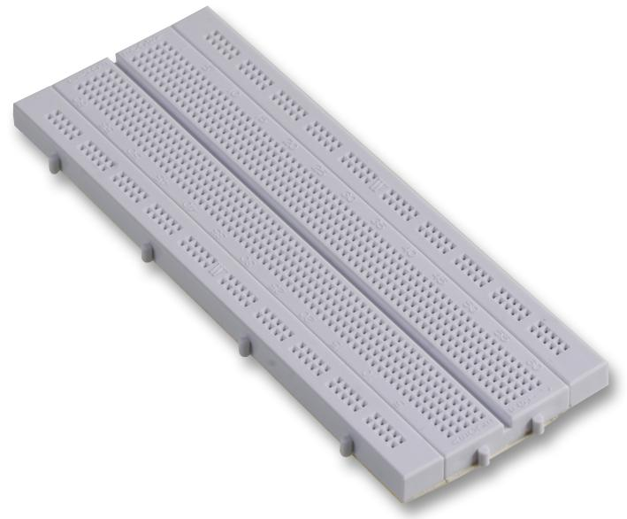

# Led-RGB :

*Ce projet est realiser dans le but d'apprendre la programmation arduino.* 

## Le projet :

Ce projet consiste à réaliser une lampe led RGB connectée, pilotable via une interface web. 

### Caractéristique :

#### Controle :

La lampe sera programmée via un **Arduino UNO** qui gerera les differents parametres, les séquences pré-programmée...

#### Design de la lampe :

La lampe sera realiser en bois de type multiplex 3mm decoupé au laser.

**Le socle** sera un pyramide de cercles creux qui contiendra les éléments electroniques (Arduino UNO, module WIFI / Bluetooth, carte led, alimentation). Sur le socle, il y aura également un encodeur digital rotatif (pour l'alumage et le paramatrage) et une led RGB de faible intensité afin d'avoir un retour visuel sur le parametrage. 

exemple :

- led rouge = reglage de l'intensité lumineuse.
- led bleue = sequences pré-programmées.
- led verte = couleur fixe

**La lampe** sera une sphere creuse constituée de plaque ajourées permettrant la diffusion de la lumiere. 

#### Matériel :

- Arduino UNO.
- 1 encodeur digital rotatif ***Whadda :*** **WPI435**.
- 7 Leds RGB a anode commune. (3*2 pour l'interieur + 1 pour le parametrage).
- 21 resistances 220ohms.
- 1 BreaBoard *pour les tests*

**Arduino UNO :**

**Led RGB *anode commune* :**

**Encodeur Digital Rotatif :**

**BreadBoard :**

## Code :

### code test feu de bois : 
    
    const int LED2_R_PIN = 3;
    const int LED2_G_PIN = 5;
    const int LED2_B_PIN = 6;
    const int LED3_R_PIN = 9;
    const int LED3_G_PIN = 10;
    const int LED3_B_PIN = 11;

    void setup() {
    // Définir les broches des LED comme des sorties
    pinMode(LED2_R_PIN, OUTPUT);
    pinMode(LED2_G_PIN, OUTPUT);
    pinMode(LED2_B_PIN, OUTPUT);
    pinMode(LED3_R_PIN, OUTPUT);
    pinMode(LED3_G_PIN, OUTPUT);
    pinMode(LED3_B_PIN, OUTPUT);
    }

    void loop() {
    // Générer des variations de couleurs chaudes pour simuler l'effet feu de cheminée
    
    int redValue2 = random(55, 0); // Rouge chaud
    int greenValue2 = random(150, 220);  // Orange chaud
    int blueValue2 = random(255, 230);   // Faible intensité de bleu
    int redValue3 = random(55, 0); // Rouge chaud
    int greenValue3 = random(130, 220);  // Orange chaud
    int blueValue3 = random(255, 230);   // Faible intensité de bleu

    analogWrite(LED2_R_PIN, redValue2);
    analogWrite(LED2_G_PIN, greenValue2);
    analogWrite(LED2_B_PIN, blueValue2);
    analogWrite(LED3_R_PIN, redValue3);
    analogWrite(LED3_G_PIN, greenValue3);
    analogWrite(LED3_B_PIN, blueValue3);

    // Ajouter un petit délai pour simuler le crépitement du feu
    delay(random(50, 500));
    }

